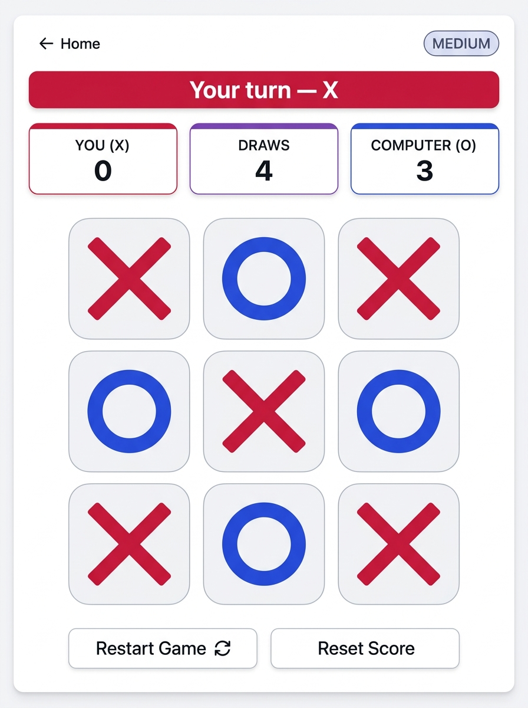

# 🎮 Tic Tac Toe — Human vs Computer

A responsive browser-based **Tic Tac Toe game** where a human player (**X**) competes against an AI-powered computer opponent (**O**).

The game includes **Easy, Medium, and Hard difficulty levels**, with the Hard mode powered by the **Minimax algorithm** to make the computer unbeatable.

Built using **HTML5, CSS3, and Vanilla JavaScript** with no frameworks, backend, or external dependencies.

---

## 🚀 Live Demo

🎮 **[Play Tic Tac Toe Online](https://jasmine-sd.github.io/tic-tac-toe-ai/)**


---

## 🖥️ Project Preview



---

## ✨ Features

- 🎮 **Human vs Computer** — Play as **X** against the computer (**O**).
- 🎯 **Three Difficulty Levels**
  - **Easy** — Random available moves.
  - **Medium** — Tactical rule-based decision making.
  - **Hard** — Unbeatable **Minimax AI**.
- 🧠 **AI Decision Making** — Different strategies are used based on the selected difficulty.
- 🔄 **Interactive Turn Indicator** — Displays the current player's turn and computer thinking state.
- 🏆 **Winning Cell Highlight** — Highlights the three cells that form the winning combination.
- 📊 **Session Scoreboard** — Tracks player wins, draws, and computer wins.
- 🔁 **Restart Game** — Starts a new round without clearing the current score.
- 🗑️ **Reset Score** — Clears the complete session scoreboard.
- ⌨️ **Keyboard Friendly** — Uses semantic buttons, focus states, and ARIA labels.
- 📱 **Responsive Design** — Works across mobile, tablet, and desktop screens.
- ✨ **Subtle Animations** — Includes turn transitions, winning-cell animations, and computer thinking feedback.

---

## 🧠 AI Difficulty Levels

### 🟢 Easy Mode

The computer selects a random available cell.

**Logic:**

1. Find all empty cells.
2. Select a random cell.
3. Place `O`.

This mode is intentionally simple and unpredictable.

---

### 🟡 Medium Mode

Medium mode uses a **rule-based heuristic strategy**.

The computer follows this priority order:

1. **Win** — If the computer can win immediately, take the winning move.
2. **Block** — If the player can win on the next move, block that position.
3. **Center** — Take the center if it is available.
4. **Corners** — Prefer available corners.
5. **Fallback** — Select any remaining empty cell.

This provides a stronger opponent without requiring a complete game-tree search.

---

### 🔴 Hard Mode — Minimax

Hard mode uses the **Minimax algorithm**, a classic decision-making algorithm used in two-player zero-sum games.

The algorithm evaluates possible future game states and chooses the optimal move.

#### How it works

1. The computer simulates every possible available move.
2. Each simulated move recursively evaluates future board states.
3. Terminal states are evaluated as:
   - **Computer Win:** Positive score
   - **Human Win:** Negative score
   - **Draw:** `0`
4. The computer chooses the move with the highest score.
5. The human player's best response is considered during the recursive evaluation.

A depth factor is also used so that the AI prefers faster wins and delays losses when necessary.

**Result:** The Hard AI cannot be defeated when it plays correctly.

---

## 🛠️ Technologies Used

| Technology | Purpose |
|------------|---------|
| **HTML5** | Semantic page structure and game interface |
| **CSS3** | Layout, styling, animations, responsive design |
| **JavaScript ES6+** | Game logic, DOM manipulation, event handling, and AI algorithms |

### Key Concepts

- DOM Manipulation
- Event Handling
- JavaScript Functions
- Arrays
- Game State Management
- Conditional Logic
- Recursion
- Minimax Algorithm
- Responsive Web Design
- CSS Grid
- CSS Animations
- Accessibility

---

## 📂 Project Structure

```text
tic-tac-toe-ai/
│
├── index.html
├── style.css
├── script.js
├── screenshots/
│   └── tic-tac-toe-game.png
└── README.md
```

### File Description

- `index.html` — Game interface and semantic HTML structure.
- `style.css` — Responsive styling, layout, and animations.
- `script.js` — Game state, event handling, win/draw detection, and AI algorithms.
- `screenshots/` — Project preview images.
- `README.md` — Project documentation.


## 🧪 Testing

The following functionality has been tested:

- [x] Player can select only empty cells.
- [x] Occupied cells cannot be selected again.
- [x] Computer moves are triggered after the player's move.
- [x] Player input is disabled while the computer is making its move.
- [x] All 8 winning combinations are detected.
- [x] Horizontal wins are detected.
- [x] Vertical wins are detected.
- [x] Diagonal wins are detected.
- [x] Draw conditions are detected.
- [x] Easy AI selects random moves.
- [x] Medium AI detects immediate wins.
- [x] Medium AI blocks player threats.
- [x] Hard AI uses Minimax for optimal play.
- [x] Player wins are tracked.
- [x] Computer wins are tracked.
- [x] Draws are tracked.
- [x] Restart Game preserves the session score.
- [x] Reset Score clears all scores.
- [x] Responsive layout tested across mobile, tablet, and desktop screen sizes.
- [x] Keyboard and accessibility features tested.

---

## 🔮 Future Improvements

- 👥 **Two-Player Local Mode** — Allow two human players to play on the same device.
- 🔊 **Sound Effects** — Add optional sounds for moves, wins, and draws.
- 🌙 **Dark Mode** — Add a theme toggle for dark-mode gameplay.
- 💾 **Persistent Scoreboard** — Store scores using browser `localStorage`.
- 🏅 **Game Statistics** — Track win rate, total games, and longest winning streak.

---

## 📌 Project Highlights

This project demonstrates practical implementation of:

- **Artificial Intelligence**
- **Minimax Algorithm**
- **Recursion**
- **Game State Management**
- **DOM Manipulation**
- **Event-Driven Programming**
- **Responsive UI Design**
- **Accessibility**

---

## 👩💻 Author

**Jasmine Sayyed**

GitHub: [@Jasmine-sd](https://github.com/Jasmine-sd)
